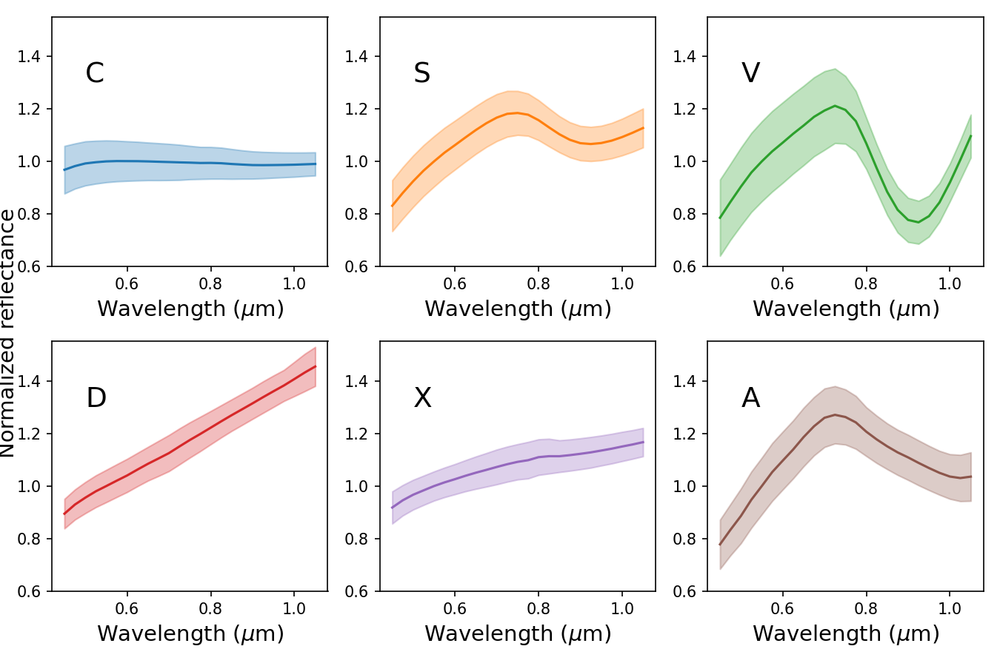

# Asteroid Taxonomy Templates

## Overview

This repository contains as simple script for loading and visualizing asteroid taxonomy templates from M. Mahlke's asteroid taxonomy. The visualization helps in understanding the classification and characteristics of various asteroid types based on their spectral properties.

## Asteroid Taxonomy


Asteroid taxonomy classifies asteroids into groups based on their spectral features, albedo, and sometimes colors. These classifications help scientists infer the compositions and origins of different asteroids, aiding in studies of the solar system's formation and evolution.

## Installation

Clone this repository using:
```bash
git clone https://github.com/yourusername/asteroid-taxonomy-visualization.git
```

## Usage

Run the visualization script:

```bash
python max_template.py
```

This will load the taxonomy templates from data/template.dat file and display the visualizations of spectral data in the visible waverange.

## Visual Example

Below is an example of a visualization of asteroid spectral types:



## Contributing
Any contributions are welcome!

## License

This project is licensed under the GNU General Public License v3.0. This license allows for free use, modification, and distribution, ensuring that all derivatives of this work are also freely available under the same terms.
